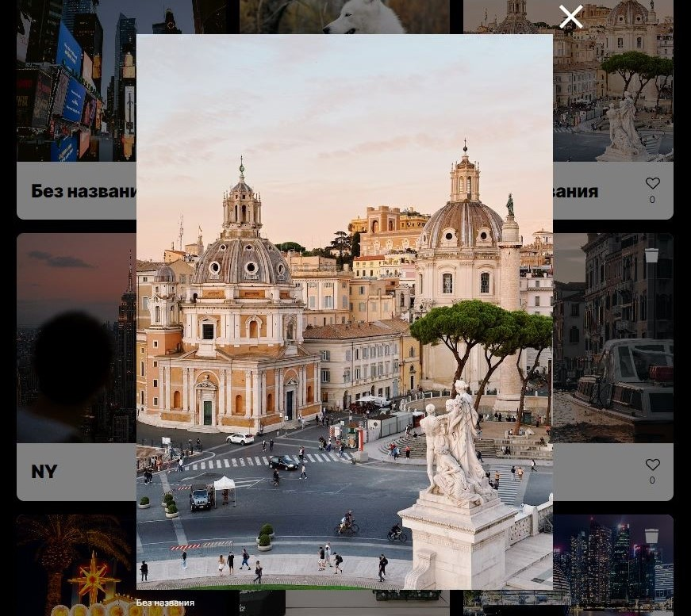

<h1 align="center">Mesto</h1>
<table border="1">
 <tr>
    <td>
      
<strong>An application where users can share photos of their favorite places.</strong>

      
Tools: React, JavaScript,  Html, CSS, Webpack.

      
The project has the following functions: 

      <ul>
        <li>Layout according to BEM methodology;</li>
        <li>Adaptability at different resolutions, including breakpoints;</li>
        <li>Using grid and flex technologies;</li>
        <li>User authorization and registration, editing user data;</li>
        <li>Adding and deleting photos and likes;</li>        
      </ul>
      
The result <a href="https://uno.nomoredomains.rocks/" target="_blank">here</a> or you can click on the image on the right.

      
***

      
<strong>Приложение, в котором пользователи могут делиться фотографиями своих любимых локаций.</strong>

      
Функционал: авторизации и регистрации пользователей, редактирование аватара и профиля, добавление и удаление фотографии и лайков, отражение количества лайков.

      
Стек: React, JavaScript,  Html, CSS, Webpack.

      
<a href="https://uno.nomoredomains.rocks/" target="_blank">Ссылка на сайт</a>
      
    </td>
    <td>
      
Click preview

      
      
***

      
    </td>
  </tr>
</table>
